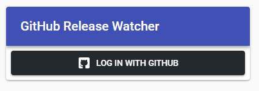
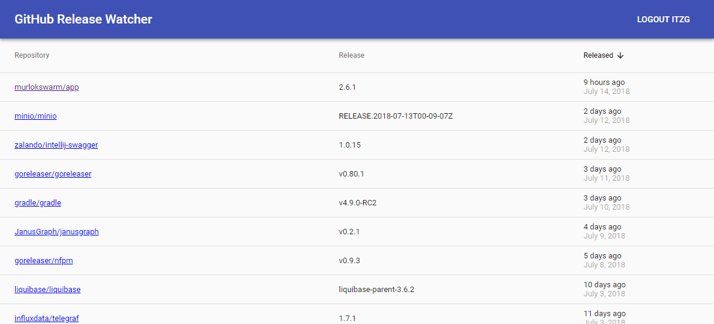

GitHub Release Watcher is a Spring Boot + React web app that shows the most recent releases from the 
repositories you have starred.

## Build

The front-end code in `src/main/app` is built via Maven, so only one step is needed:

```bash
mvn package
```

[In this article](https://medium.com/@itzgeoff/including-react-in-your-spring-boot-maven-build-ae3b8f8826e) I
talk about how that was configured.

## Walkthrough

First, you'll login via your existing GitHub account:



All of the repositories you have starred will be retrieved and displayed in order of newest star first.

Click on either the "Repository" or "Released" column headers to change the sort order. In this example,
I'm sorting by most recent releases first by clicking once on that column:



